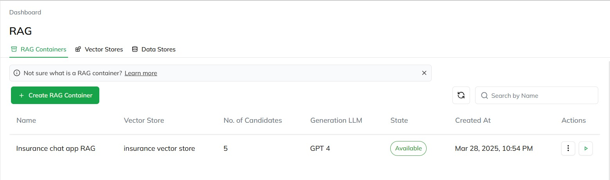
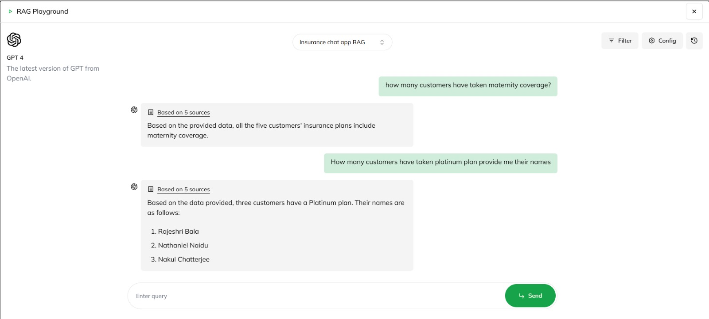
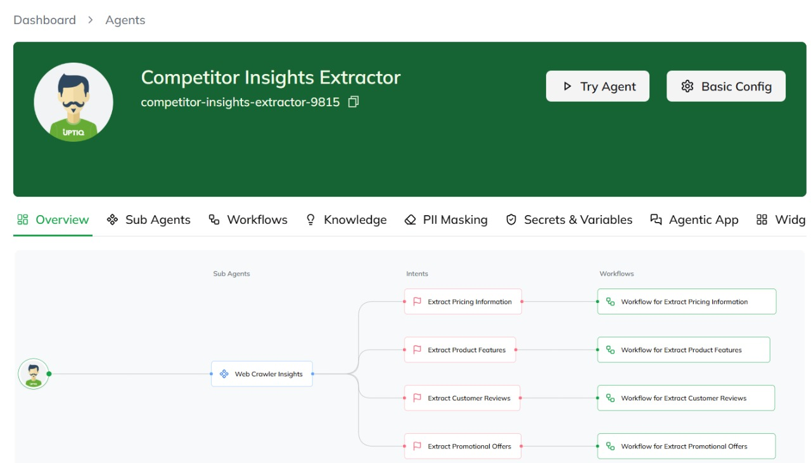
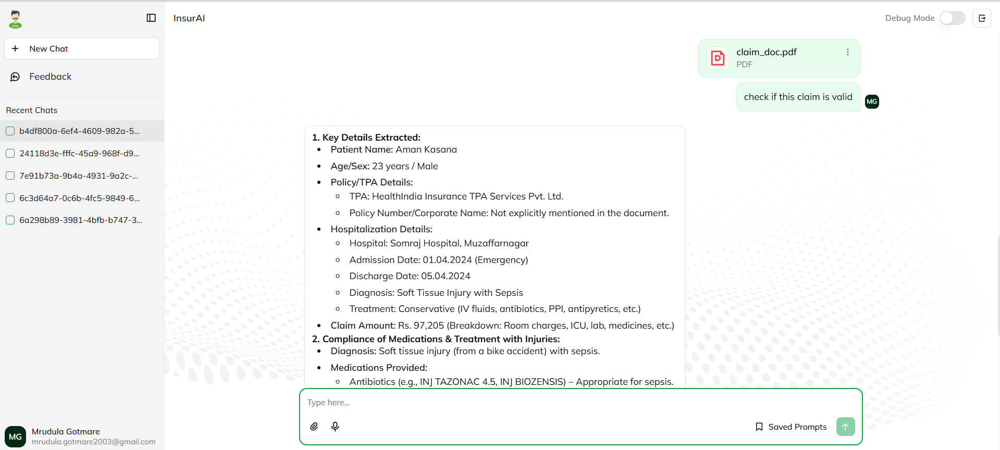

# 🚀 InsurAI
## [📄 Document with uptiq screenshots ](https://docs.google.com/document/d/1fPQrNFWIAjhBeFarG0BE8zfYT74VIS0f_JlihpdfmYo/edit?usp=sharing)  
## [Video Link](https://youtu.be/F7vaE0me3tg)

## [If video not accessible : ](https://drive.google.com/drive/u/0/folders/1vGEozSQ5H-qEJSH47x5aP9WE9Q571eeG)
## 📌 Key Features

### 1️⃣ Demographic-Driven Recommendations  
🔹 Identifies untapped customer segments (age, location, occupation).  
🔹 Uses clustering and Gen AI insights to recommend tailored insurance products.  

### 2️⃣ Real-Time Parametric Triggers  
🔹 Dynamically adjusts coverage and pricing based on:  
   - Real-time data from weather APIs  
   - Health wearables  
   - Behavioral pattern analysis  
🔹 Ensures adaptive risk management and personalized policies.  

### 3️⃣ Autonomous Claims & Fraud Detection  
🔹 Automates claims processing by analyzing documents against IRDAI guidelines.  
🔹 Detects potential fraud, ensures compliance, and generates underwriting summaries.  

### 4️⃣ Chatbot for Insights  
🔹 Answers strategic queries (e.g., “Which policies are underperforming?”).  
🔹 Uses company data to:  
   - Compare market trends  
   - Optimize pricing  
   - Forecast future claim surges  
   - Perform risk profiling  

---

## 🎯 Why It Was Implemented?

✅ **Demographic-Driven Recommendations** – Helps insurers tap into new customer segments by offering personalized policies based on age, location, and occupation, leading to increased market reach and customer engagement.
 
✅ **Real-Time Parametric Triggers** –  Ensures adaptive risk management by dynamically adjusting coverage and pricing based on external factors like weather conditions, health metrics, and behavioral patterns, reducing underwriting risks and enhancing customer trust.

✅ **Autonomous Claims & Fraud Detection** – Speeds up claims processing while reducing fraud by cross-checking claims with IRDAI guidelines, ensuring compliance, and providing detailed underwriting summaries for informed decision-making.

✅ **Chatbot for Insights** – Empowers insurers with AI-driven strategic insights, helping them identify underperforming policies, optimize pricing based on market trends, forecast future claims, and enhance risk profiling.

---

## 🏗️ Tech Stack Used

### 📌 **Frontend:**  
- React.js  

### ⚙️ **Backend:**  
- Python  
- Flask / FastAPI  
- Uptiq  

### 🔗 **APIs Used:**  
- OpenWeather API  
- Gemini  

### 🗄️ **Database:**  
- Firebase  
- MongoDB  

---

## 📊 Project Flowchart  
.png)  

---

## 🚀 Current Progress with Screenshots  

### 💰 Pricing Analysis  
  

### 📊 RAG Analysis 1  
  

### 📊 RAG Analysis 2  
  

### 🔍 Competitor Analysis  
  

### ⚙️ Claim Processing  

---
## Changes after Mentor Suggestions : 

 Implemented RAG for health premium adjustment based on health data .
