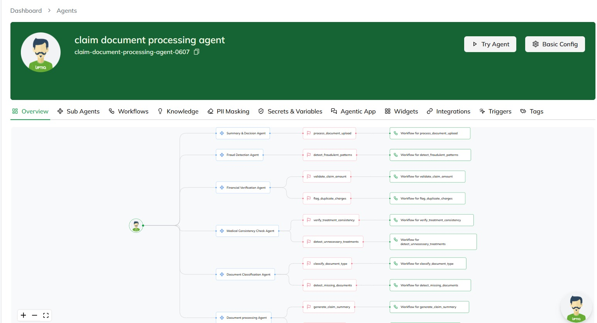

# 🚀 InsurAI

## 📌 Key Features

### 1️⃣ Demographic-Driven Recommendations  
🔹 Identifies untapped customer segments (age, location, occupation).  
🔹 Uses clustering and Gen AI insights to recommend tailored insurance products.  

### 2️⃣ Real-Time Parametric Triggers  
🔹 Dynamically adjusts coverage and pricing based on:  
   - Real-time data from weather APIs  
   - Health wearables  
   - Behavioral pattern analysis  
🔹 Ensures adaptive risk management and personalized policies.  

### 3️⃣ Autonomous Claims & Fraud Detection  
🔹 Automates claims processing by analyzing documents against IRDAI guidelines.  
🔹 Detects potential fraud, ensures compliance, and generates underwriting summaries.  

### 4️⃣ Chatbot for Insights  
🔹 Answers strategic queries (e.g., “Which policies are underperforming?”).  
🔹 Uses company data to:  
   - Compare market trends  
   - Optimize pricing  
   - Forecast future claim surges  
   - Perform risk profiling  

---

## 🎯 Why It Was Implemented?

✅ **Demographic-Driven Recommendations** – Expands market reach by personalizing policies based on customer data.  
✅ **Real-Time Parametric Triggers** – Reduces underwriting risks and enhances customer trust with adaptive pricing.  
✅ **Autonomous Claims & Fraud Detection** – Improves efficiency, speeds up claims processing, and prevents fraud.  
✅ **Chatbot for Insights** – Helps insurers make data-driven decisions by forecasting risks and optimizing policy pricing.  

---

## 🏗️ Tech Stack Used

### 📌 **Frontend:**  
- React.js  

### ⚙️ **Backend:**  
- Python  
- Flask / FastAPI  
- Uptiq  

### 🔗 **APIs Used:**  
- OpenWeather API  
- Gemini  

### 🗄️ **Database:**  
- Firebase  
- MongoDB  

---

## 📊 Project Flowchart  
.png)  

---

## 🚀 Current Progress with Screenshots  

### 💰 Pricing Analysis  
  

### 📊 RAG Analysis 1  
  

### 📊 RAG Analysis 2  
  

### 🔍 Competitor Analysis  
  

### ⚙️ Processing  
  

---
## Changes after Mentor Suggestions : 

 Implemented RAG for health premium adjustment based on health data .
